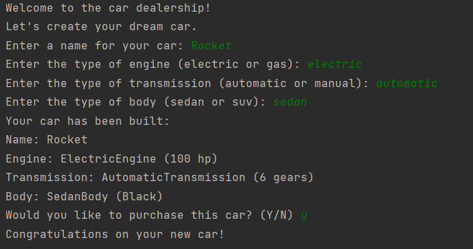

# Car Dealership Program

This is a simple Java program that allows customers to build and customize their own car, and then purchase it. The program uses four different creational design patterns to create a flexible and modular architecture.

## Getting Started

To run this program, you will need to have Java installed on your computer. You can download Java from the official website.

1. Clone this repository to your local machine using git clone https://github.com/your-username/car-dealership.git
2. Navigate to the project directory using cd car-dealership
3. Compile the Java files using javac *.java
4. Run the program using java Main

## Usage

When you run the program, you will be prompted to enter details for a new car. You can customize the engine, transmission, and body of the car by selecting different options from the menu. Once you have created your car, the program will display the details of the car and prompt you to purchase it.

## Design Patterns

This program uses the following creational design patterns:

1. Singleton Pattern: Used to ensure that only one instance of the CarFactory class is created.
2. Builder Pattern: Used to create a new Car object with optional parameters in a flexible and readable way.
3. Factory Method Pattern: Used to create different types of engines, transmissions, and bodies based on input.
4. Abstract Factory Pattern: Used to group different types of engines, transmissions, and bodies into related families.

## Singleton Pattern

In software engineering, the singleton pattern is a software design pattern that restricts the instantiation of a class to a singular instance. One of the well-known "Gang of Four" design patterns, which describe how to solve recurring problems in object-oriented software, the pattern is useful when exactly one object is needed to coordinate actions across a system.

More specifically, the singleton pattern allows objects to:

1. Ensure they only have one instance
2. Provide easy access to that instance
3. Control their instantiation (for example, hiding the constructors of a class)
4. The term comes from the mathematical concept of a singleton.

The CarFactory class uses the Singleton pattern to ensure that only one instance of the class is created:

    public class CarFactory {
    // Create a static instance of the CarFactory class
    private static CarFactory instance = new CarFactory();

    // Private constructor to prevent other classes from creating instances
    private CarFactory() {}
    
    // Public static method to retrieve the singleton instance
    public static CarFactory getInstance() {
        return instance;
    }
    
    // ...
    }

## Builder Pattern

Builder pattern was introduced to solve some of the problems with Factory and Abstract Factory design patterns when the Object contains a lot of attributes. There are three major issues with Factory and Abstract Factory design patterns when the Object contains a lot of attributes.

1. Too Many arguments to pass from client program to the Factory class that can be error prone because most of the time, the type of arguments are same and from client side its hard to maintain the order of the argument.
2. Some of the parameters might be optional but in Factory pattern, we are forced to send all the parameters and optional parameters need to send as NULL.
3. If the object is heavy and its creation is complex, then all that complexity will be part of Factory classes that is confusing.

The Car class uses the Builder pattern to create a new car object with optional parameters in a flexible and readable way:

    public class Car {
        private Engine engine;
        private Transmission transmission;
        private Body body;
        private String color;
    // ...

    // Private constructor to prevent direct instantiation
    private Car(Builder builder) {
        this.engine = builder.engine;
        this.transmission = builder.transmission;
        this.body = builder.body;
        this.color = builder.color;
    }
    
    // Nested Builder class
    public static class Builder {
        private Engine engine;
        private Transmission transmission;
        private Body body;
        private String color;
        
        public Builder() {}
        
        public Builder engine(Engine engine) {
            this.engine = engine;
            return this;
        }
        
        public Builder transmission(Transmission transmission) {
            this.transmission = transmission;
            return this;
        }
        
        public Builder body(Body body) {
            this.body = body;
            return this;
        }
        
        public Builder color(String color) {
            this.color = color;
            return this;
        }
        
        public Car build() {
            return new Car(this);
        }
    }
    
    // ...
    }

## Factory Method Pattern

The factory design pattern is used when we have a superclass with multiple sub-classes and based on input, we need to return one of the sub-class. This pattern takes out the responsibility of the instantiation of a class from the client program to the factory class. Let’s first learn how to implement a factory design pattern in java and then we will look into factory pattern advantages. We will see some of the factory design pattern usage in JDK. Note that this pattern is also known as Factory Method Design Pattern.

The CarFactory class uses the Factory Method pattern to create different types of engines, transmissions, and bodies based on input:

    public class CarFactory {
    // ...

    public Engine createEngine(String type) {
        switch (type) {
            case "V6":
                return new V6Engine();
            case "V8":
                return new V8Engine();
            default:
                throw new IllegalArgumentException("Invalid engine type: " + type);
        }
    }
    
    public Transmission createTransmission(String type) {
        switch (type) {
            case "Automatic":
                return new AutomaticTransmission();
            case "Manual":
                return new ManualTransmission();
            default:
                throw new IllegalArgumentException("Invalid transmission type: " + type);
        }
    }
    
    public Body createBody(String type) {
        switch (type) {
            case "Sedan":
                return new SedanBody();
            case "SUV":
                return new SUVBody();
            default:
                throw new IllegalArgumentException("Invalid body type: " + type);
        }
    }
    
    // ...
    }

## Abstract Factory Pattern

Abstract Factory patterns work around a super-factory which creates other factories. This factory is also called as factory of factories. This type of design pattern comes under creational pattern as this pattern provides one of the best ways to create an object.

In Abstract Factory pattern an interface is responsible for creating a factory of related objects without explicitly specifying their classes. Each generated factory can give the objects as per the Factory pattern.

The Engine, Transmission, and Body classes are grouped into related families using the Abstract Factory pattern:

    public abstract class Engine {
        public abstract String getType();
    }
    
    // V6Engine class (Concrete Product)
    public class V6Engine extends Engine {
    @Override
        public String getType() {
            return "V6";
        }
    }
    
    // V8Engine class (Concrete Product)
    public class V8Engine extends Engine {
    @Override
        public String getType() {
            return "V8";
        }
    }
    
    // Abstract Transmission class
    public abstract class Transmission {
        public abstract String getType();
    }

## Conclusion
In this project, we created a simple car dealership program in Java that allows customers to build and customize their own car and then purchase it. We used four different creational design patterns to implement this program: Abstract Factory, Builder, Singleton, and Factory Method.

The Abstract Factory pattern was used to encapsulate the creation of different parts of a car, such as the engine, transmission, and body, into different factories. This allowed us to easily switch between different implementations of those parts without affecting the rest of the code.

The Builder pattern was used to create a fluent interface for building a car, which made it easy for customers to customize the car to their liking.

The Singleton pattern was used to ensure that only one instance of the CarDealership class could exist at a time, which prevented customers from creating multiple instances of the dealership and potentially causing issues with purchasing a car.

Finally, the Factory Method pattern was used to create different types of cars, such as electric cars or petrol cars, by encapsulating the creation of those cars in different factories.

Overall, by using these design patterns, we were able to create a modular and extensible car dealership program that can easily be expanded and modified in the future.
